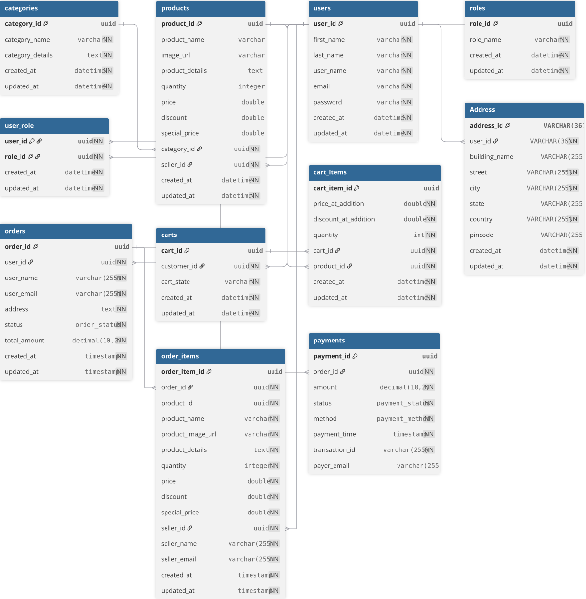

# Souqly E-Commerce Backend 🛍️

Souqly is a robust and scalable backend system for an e-commerce platform, built with Java and the Spring Boot framework. It includes essential features like user authentication, product management, a shopping cart, and secure payment processing via Stripe.

[](https://github.com/souqly/souqly)
[](https://opensource.org/licenses/MIT)
[](https://www.java.com)
[](https://spring.io/projects/spring-boot)
[](https://stripe.com)

***

## ✨ Key Features

* **Authentication**: Secure user registration and login using JWT (JSON Web Tokens).
* **Product & Category Management**: Full CRUD operations for products and categories.
* **Shopping Cart**: Persistent shopping cart functionality for authenticated users.
* **Address Management**: Users can manage multiple shipping addresses.
* **Secure Checkout**: Integration with Stripe for handling payments, with webhook support for real-time updates.
* **Transactional Operations**: Ensures data integrity during complex operations like checkout and payment failure rollbacks.
* **Centralized Exception Handling**: Provides consistent and clear API error responses.

***

## ⚙️ Tech Stack

* **Backend**: Spring Boot, Spring Security, Spring Data JPA
* **Database**: MySQL
* **Authentication**: JSON Web Tokens (JWT)
* **Payments**: Stripe API
* **Build Tool**: Maven

***

## 🚀 Getting Started

Follow these instructions to get a local copy up and running for development and testing.

### Prerequisites

* Java JDK 17 or later
* Apache Maven
* MySQL Server
* A Stripe account and API keys (secret key)

### Installation & Setup

1.  **Clone the repository:**
    ```sh
    git clone [https://github.com/your-username/souqly.git](https://github.com/your-username/souqly.git)
    cd souqly
    ```

2.  **Configure the application:**
    Open `src/main/resources/application.properties` and update the following properties with your local environment details:
    ```properties
    # MySQL Database Configuration
    spring.datasource.url=jdbc:mysql://localhost:3306/souqly
    spring.datasource.username=your-db-user
    spring.datasource.password=your-db-password

    # JWT Secret for token generation
    jwt.secret=your-super-secret-key-for-jwt

    # Stripe API Secret Key
    stripe.api.key=sk_test_yourstripesecretkey
    ```

3.  **Setup the database:**
    Connect to your MySQL instance and run the SQL script provided in the project (`database.sql` or similar) to create the necessary tables and schema.

4.  **Build and run the application:**
    ```sh
    # Build the project and run tests
    mvn clean install

    # Run the application
    java -jar target/souqly-0.0.1-SNAPSHOT.jar
    ```
    The API will be available at `http://localhost:8080`.

***
## 🗃️ Project Structure
```
souqly/
├── controller/ # REST API controllers
│ └── Handles HTTP requests and maps them to service layer methods.
│
├── model/ # JPA entity classes
│ └── Contains the domain models that map to database tables.
│
├── payload/ # DTOs and API response models
│ └── Defines data and validate transfer objects used for requests and responses.
│
├── exception/ 
│ └── Defines different custom  excpetion.
│
├── repository/ # Spring Data JPA repositories
│ └── Interfaces for data access, extending JpaRepository or CrudRepository.
│
├── service/ # Business logic and service layer
│ └── Contains core application logic, separated from web layer.
│
└── security/ # JWT authentication and security configuration
└── Manages security filters, JWT utils, and Spring Security setup.

```

***

## 🗃️ Database Schema

The database is designed to support the core e-commerce functionalities, including relationships between users, products, orders, and payments.

**Entity Relationship Diagram (ERD)**

*(Replace `ERD.png` in the root directory with your actual diagram image)*



***

## 📖 API Documentation

All endpoints require a JWT Bearer Token in the `Authorization` header, except for the `Auth` and `Stripe Webhook` endpoints.

<details>
<summary>🔐 <strong>AuthController</strong></summary>

### 🚪 Sign In
- **Method**: `POST`
- **Endpoint**: `/api/auth/signin`
- **Description**: Authenticates a user and returns a JWT in an HTTP-only cookie.
- **Request Body**:
  ```json
  {
    "username": "userName",
    "password": "password123"
  }
  ```
- **Response** (`200 OK`):
  - A `Set-Cookie` header containing the JWT.
  - A response body with user details.
  ```json
  {
    "userId": "UUID",
    "username": "userName",
    "roles": ["CUSTOMER","SELLER"]
  }
  ```

---

### 🆕 Sign Up
- **Method**: `POST`
- **Endpoint**: `/api/auth/signup`
- **Description**: Registers a new user.
- **Request Body**:
  ```json
  {
    "firstName": "John",
    "lastName": "Doe",
    "userName": "johndoe",
    "email": "john.doe@example.com",
    "password": "a-strong-password"
  }
  ```
- **Response** (`201 CREATED`):
  ```json
  {
    "success": true,
    "message": "User registered successfully!",
    "data": null
  }
  ```
### ❌ Sign Up
- **Method**: `POST`
- **Endpoint**: `/api/auth/signout`
- **Description**: logout from the website.
- **Response** (`200 ok`):
  - A `Set-Cookie` with Max-Age=0 header containing the JWT.
  - A response body>
  ```json
  {
    "success": true,
    "message": "You've been signed out!",
    "data": null
  }
  ```
  
</details>

---

<details>
<summary>🏠 <strong>AddressController</strong></summary>

### ➕ Add New Address
- **Method**: `POST`
- **Endpoint**: `/api/address/add`
- **Description**: logged-in user add a new address to his profile.
- **Request Body**:
  ```json
  {
    "buildingName": "123 E-Commerce St",
    "street": "Tech Avenue",
    "city": "Cairo",
    "state": "Cairo Governorate",
    "country": "Egypt",
    "pincode": "11511"
  }
  ```
- **Response** (`201 CREATED`):
  ```json
  {
    "success": true,
    "message": "Address added successfully",
    "data": {
      "addressId": "uuid",
      "userId": "uuid",
      "buildingName": "123 E-Commerce St",
      "street": "Tech Avenue",
      "city": "Cairo",
      "state": "Cairo Governorate",
      "country": "Egypt",
      "pincode": "11511",
      "createdAt": "timestamp",
      "updatedAt": "timestamp"
    }
  }
  ```

---

### ✏️ Update Address
- **Method**: `PUT`
- **Endpoint**: `/api/address/update/{addressId}`
- **Description**: logged-in user update one of his addresses.
- **Request Body**:
  ```json
  {
    "buildingName": "Updated Building Name",
    "street": "Updated Street",
    "city": "Giza",
    "state": "Giza Governorate",
    "country": "Egypt",
    "pincode": "12555"
  }
  ```
- **Response** (`200 OK`):
  ```json
  {
    "success": true,
    "message": "Address updated successfully",
    "data": {
        "addressId": "uuid",
        "userId": "uuid",
        "buildingName": "Updated Building Name",
        "street": "Updated Street",
        "city": "Giza",
        "state": "Giza Governorate",
        "country": "Egypt",
        "pincode": "12555",
        "createdAt": "timestamp",
        "updatedAt": "timestamp"
    }
  }
  ```

---

### ❌ Delete Address
- **Method**: `DELETE`
- **Endpoint**: `/api/address/delete/{addressId}`
- **Description**: logged-in user delete one of his addresses.
- **Response** (`200 OK`):
  ```json
  {
    "success": true,
    "message": "Address deleted successfully",
    "data": null
  }
  ```

---

### 📋 Get All User Addresses
- **Method**: `GET`
- **Endpoint**: `/api/address/get-all`
- **Description**: logged-in user view all addresses in his profile.
- **Response** (`200 OK`):
  ```json
  {
    "success": true,
    "message": "All addresses retrieved successfully",
    "data": {
        "records": [
            {
                "addressId": "uuid",
                "userId": "uuid",
                "buildingName": "...",
                "street": "...",
                "city": "...",
                "state": "...",
                "country": "...",
                "pincode": "...",
                "createdAt": "timestamp",
                "updatedAt": "timestamp"
            }
        ],
        "totalRecords": 1
    }
  }
  ```

---

### 🆔 Get Address by ID
- **Method**: `GET`
- **Endpoint**: `/api/address/get/{addressId}`
- **Description**: logged-in user view one of his addresses.
- **Response** (`200 OK`):
  ```json
  {
    "success": true,
    "message": "Address retrieved successfully",
    "data": {
      "addressId": "uuid",
      "userId": "uuid",
      "buildingName": "...",
      "street": "...",
      "city": "...",
      "state": "...",
      "country": "...",
      "pincode": "...",
      "createdAt": "timestamp",
      "updatedAt": "timestamp"
    }
  }
  ```

</details>

---

<details>
<summary>📂 <strong>CategoryController</strong></summary>

### ➕ Create Category
- **Method**: `POST`
- **Endpoint**: `/api/category`
- **Description**: Admin create a new Category.
- **Request Body**:
  ```json
  {
    "categoryName": "string",
    "categoryDetails": "string"
  }
  ```
- **Response**:
  ```json
  {
    "success": true,
    "message": "Category created successfully",
    "data": {
      "id": "uuid",
      "categoryName": "string",
      "categoryDetails": "string"
    }
  }
  ```

---

### ✏️ Update Category
- **Method**: `PUT`
- **Endpoint**: `/api/category/{id}`
- **Description**: Admin update an existing Category.
- **Request Body**:
  ```json
  {
    "categoryName": "string",
    "categoryDetails": "string"
  }
  ```
- **Response**:
  ```json
  {
    "success": true,
    "message": "Category updated successfully",
    "data": {
      "id": "uuid",
      "categoryName": "string",
      "categoryDetails": "string"
    }
  }
  ```

---

### ❌ Delete Category
- **Method**: `DELETE`
- **Endpoint**: `/api/category/{id}`
- **Description**: Admin delete an existing Category.
- **Response**:
  ```json
  {
    "success": true,
    "message": "Category deleted successfully"
  }
  ```

---

### 📋 Get All Categories
- **Method**: `GET`
- **Endpoint**: `/api/category/get-all`
- **Description**: Fetching all Categories.
- **Response**:
  ```json
  {
    "success": true,
    "message": "Categories retrieved successfully",
    "data": [
      {
        "id": "uuid",
        "categoryName": "string",
        "categoryDetails": "string"
      }
    ]
  }
  ```

---

### 🆔 Get Category by ID
- **Method**: `GET`
- **Endpoint**: `/api/category/{categoryId}`
- **Description**: Fetching a specific category
- **Response**:
  ```json
  {
    "success": true,
    "message": "Category retrieved successfully",
    "data": {
      "id": "uuid",
      "categoryName": "string",
      "categoryDetails": "string"
    }
  }
  ```

</details>

---

<details>
<summary>📦 <strong>ProductController</strong></summary>

### ➕ Create Product
- **Method**: `POST`
- **Endpoint**: `/api/product`
- **Description**: Seller add a new product.
- **Request Body**:
  ```json
  {
    "productName": "string",
    "productDetails": "string",
    "quantity": 0,
    "price": 0.0,
    "discount": 0.0,
    "categoryId": "uuid"
  }
  ```
- **Response**:
  ```json
  {
    "success": true,
    "message": "Product created successfully",
    "data": {
      "productId": "uuid",
      "productName": "string",
      "productDetails": "string",
      "quantity": 0,
      "price": 0.0,
      "discount": 0.0,
      "specialPrice": 0.0,
      "imageUrl": "string",
      "category": { "...categoryObject" }
    }
  }
  ```

---

### ✏️ Update Product
- **Method**: `PUT`
- **Endpoint**: `/api/product/{id}`
- **Description**: Seller update one of his products.
- **Request Body**:
  ```json
  {
    "productName": "string",
    "productDetails": "string",
    "quantity": 0,
    "price": 0.0,
    "discount": 0.0,
    "categoryId": "uuid"
  }
  ```
- **Response**:
  ```json
  {
    "success": true,
    "message": "Product updated successfully",
    "data": {
      "productId": "uuid",
      "productName": "string",
      "productDetails": "string",
      "quantity": 0,
      "price": 0.0,
      "discount": 0.0,
      "specialPrice": 0.0,
      "imageUrl": "string",
      "category": { "...categoryObject" }
    }
  }
  ```

---

### ❌ Delete Product
- **Method**: `DELETE`
- **Endpoint**: `/api/product/{id}`
- **Description**: Seller delete one of his products.
- **Response**:
  ```json
  {
    "success": true,
    "message": "Product deleted successfully"
  }
  ```

---

### 📋 Get All Products
- **Method**: `GET`
- **Endpoint**: `/api/product/get-all`
- **Description**: Fetching all products.
- **Response**:
  ```json
  {
    "success": true,
    "message": "Products retrieved successfully",
    "data": [
      {
        "productId": "uuid",
        "productName": "string",
        "productDetails": "string",
        "quantity": 0,
        "price": 0.0,
        "discount": 0.0,
        "specialPrice": 0.0,
        "imageUrl": "string",
        "category": { "...categoryObject" }
      }
    ]
  }
  ```

</details>

---

<details>
<summary>🛒 <strong>CartController</strong></summary>

### ➕ Add Product to Cart
- **Method**: `POST`
- **Endpoint**: `/api/cart/add-product`
- **Description**: Customer add product to his shopping cart.
- **Request Body**:
```json
{
  "productId": "UUID",
  "quantity": 2
}
```
- **Response** (`201 CREATED`):
```json
{
  "success": true,
  "message": "Product add successfully",
  "data": { cartItem
    "cartItemId":"UUID",
    "cartId":"UUID", user active cart id 
    "productId" : "UUID",
    "priceAtAddition" : 1000,  price of product at moment of adding to cart
    "discountAtAddition" : 10 ,
    "specialPriceAtAddition" : 900, price after discount
    "quantity" : 2,
    "currentPrice" : 1000, current price of product
    "currentDiscount" : 10 ,
    "currentSpecialPrice" : 900 ,
    "availableForRequiredQuantity" : true , to indicate the availability of the product
                                              with required quantity in the stock,
    "priceChangedSinceAdded" : false , to indicate price changing compared with the price at sddition 
    "productDeleted" : false

    "product" : { product data
    }
  }
}
  ```

---

### 👀 View User Cart
- **Method**: `GET`
- **Endpoint**: `/api/cart/view`
- **Description**: Returns the current authenticated user's cart.
- **Response** (`200 OK`):
```json
{
  "success": true,
  "message": "success",
  "data": {
    "cartId": "cart-uuid",
    "customerId": "user-uuid",
    "cartState": "ACTIVE",
    "createdAt": "2025-07-19T12:45:00",
    "updatedAt": "2025-07-19T12:46:10",
    "totalItems": 3,
    "totalPriceAtAddition": 100.0,
    "currentTotalPrice": 95.5,
    "items": [
      {
        "cartItemId": "item-uuid",
        "productId": "product-uuid",
        "quantity": 2,
        "priceAtAddition": 50,
        "discountAtAddition": 5,
        "specialPriceAtAddition": 0,
        "currentPrice": 48,
        "currentDiscount": 6,
        "currentSpecialPrice": 0,
        "availableForRequiredQuantity": true,
        "priceChangedSinceAdded": true,
        "productDeleted": false,
        "productResponse": { /* ProductResponse object */ },
        "createdAt": "2025-07-19T12:44:00",
        "updatedAt": "2025-07-19T12:46:00"
      }
    ]
  }
}

  ```

---

### ❌ Delete Cart Item
- **Method**: `DELETE`
- **Endpoint**: `/api/cart/delete/{cartItemId}`
- **Description**: Removes a specific item from the cart.
- **Response** (`200 OK`):
```json
{
  "success": true,
  "message": "item deleted from the cart successfully"
}

```

---

### 🔁 Update Cart Item Quantity
- **Method**: `PUT `
- **Endpoint**: `/api/cart/update/{cartItemId}`
- **Description**: Changes the quantity of an item in the cart using a delta value (positive or negative).
- **Request**
```json
{
  "delta": 1
}
```
- **Response** (`200 OK`):
```json
{
  "success": true,
  "message": "item updated from the cart successfully",
  "data": { /* updated CartItemResponse or null */ }
}

```

</details>

---


<details>
<summary>💳 <strong>CheckoutController</strong></summary>

### ⏩ Proceed to Checkout
- **Method**: `POST`
- **Endpoint**: `/api/checkout`
- **Description**: Creates an order from the cart and returns a Stripe payment URL.
- **logic**:
  - fetch user active cart
  - validate products availability
  - create new order PENDING and list order items
  - change user cart state to CHECKED_OUT
  - generate stripe session for payment
  - create a new payment record in DB
- **Request Body**:
  ```json
  {
    "addressId": "a1b2c3d4-e5f6-7890-1234-567890abcdef"
  }
  ```
- **Response** (`200 OK`):
  ```json
  {
    "success": true,
    "message": "Checkout session created successfully",
    "data": {
      "orderResponse": {
        "orderId": "uuid",
        "totalAmount": 199.99,
        "items": [
            {
                "orderItemId": "uuid",
                "productName": "string",
                "quantity": 2,
                "specialPrice": 99.99
            }
        ]
      },
      "paymentUrl": "[https://checkout.stripe.com/pay/](https://checkout.stripe.com/pay/)..."
    }
  }
  ```

---

### 🔔 Stripe Webhook
- **Method**: `POST`
- **Endpoint**: `/stripe/webhook`
- **Description**: Handles events from Stripe to update payment and order status.
- **Authentication**: None. Verified via `Stripe-Signature` header.
- **Request Header**:
  - `Stripe-Signature`: Required.
- **Request Body**: Raw JSON payload from the Stripe event.
- Different events
  - checkout.session.completed
    - change order state to COMPLETED
    - change payment state to SUCCESS
  - failed or session closed
    - change order state to CANCELLED
    - change payment state FAILED
    - return order products to stock
- **Response**: `200 OK` or `400 Bad Request`.

</details>

***

## 🤝 Contributing

Contributions are welcome! Please fork the repo and submit a pull request.

